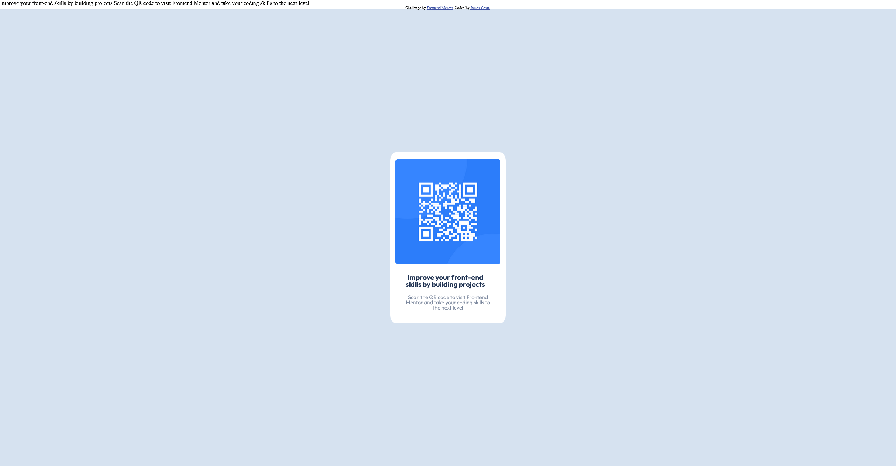

# Frontend Mentor - QR code component solution

This is a solution to the [QR code component challenge on Frontend Mentor](https://www.frontendmentor.io/challenges/qr-code-component-iux_sIO_H). Frontend Mentor challenges help you improve your coding skills by building realistic projects. 

## Table of contents

- [Overview](#overview)
  - [Screenshot](#screenshot)
  - [Links](#links)
- [My process](#my-process)
  - [Built with](#built-with)
  - [What I learned](#what-i-learned)
  - [Useful resources](#useful-resources)
- [Author](#author)

**Note: Delete this note and update the table of contents based on what sections you keep.**

## Overview

### Screenshot




### Links

- Live Site URL: [Add live site URL here](https://dropperdev.github.io/challenge-qr-code/)

## My process
  I started creating divs, with a principal div being the centralized div.
  I also replace the divs to semantic tags.
  CSSS i change the colors of divs to differentiate the boxes.
  And i just imitated the preview img.
### Built with

- Semantic HTML5 markup
- CSS custom properties
- Flexbox
- Mobile-first workflow

**Note: These are just examples. Delete this note and replace the list above with your own choices**

### What I learned

  I learned about margin, padding and width.

```html
  <main>
        <section>
            <figure>
              
            </figure>
            <article>
              <h1>Improve your front-end skills by building projects</h1>
              <p>Scan the QR code to visit Frontend Mentor and take your coding skills to the next level</p>
            </article>
        </section>
  </main>
 **Totally semantic
```
```css
section figure{
    width: fit-content;
}
```

## Useful resources
  - https://meyerweb.com/eric/tools/css/reset/  **Good reset**
  - https://developer.mozilla.org/pt-BR/ **Useful informations**

  

## Author
- Frontend Mentor - [@JamesSoaresCosta](https://www.frontendmentor.io/profile/yourusername)
- Github - [@DropperDEV](https://github.com/DropperDEV)